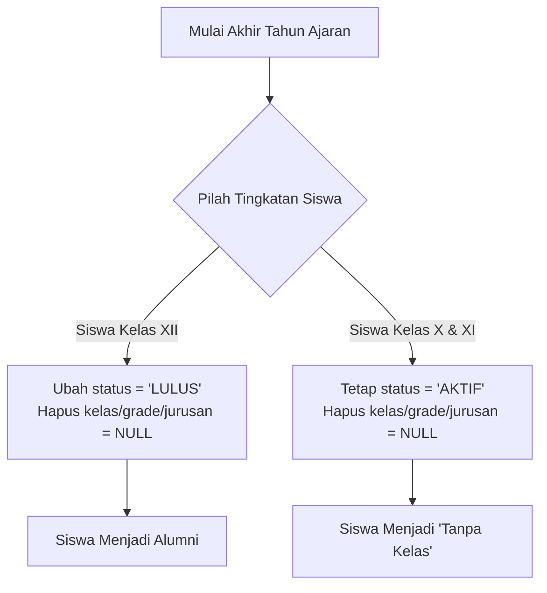

# 📘 PETUNJUK TEKNIS (JUKNIS) OPERASIONAL APLIKASI SITAB (SISTEM TABUNGAN)

Dokumen Juknis ini dirancang sebagai panduan lengkap alur kerja (*flow*), mekanisme teknis, dan prosedur operasional untuk aplikasi **SITAB (Sistem Informasi Tabungan Siswa)**.

---

## 1. PENDAHULUAN & ARSITEKTUR INTEGRITAS DATA

SITAB adalah aplikasi berbasis web yang berfungsi untuk mencatat tabungan siswa secara harian. Untuk menjaga keamanan keuangan sekolah:
*   **Integritas Data Keuangan**: Semua data saldo, nominal transaksi, dan histori penyetoran/pemotongan didasarkan pada **NIS (Nomor Induk Siswa)** sebagai kata kunci utama (*Primary Key*).
*   **Keamanan Riwayat**: Kenaikan kelas, perubahan nama kelas, kelulusan, atau penghapusan kelas **TIDAK AKAN MENGHAPUS** histori transaksi keuangan siswa. Riwayat tabungan tetap tersimpan utuh di database.

---

## 2. HAK AKSES & PORTAL KHUSUS (ADMIN, GURU/WALAS, ORANG TUA)

Aplikasi SITAB menyediakan tiga pintu masuk utama yang disesuaikan dengan peran pengguna:

### A. Portal Admin (`/admin` & `/admin/setor`)
*   **Target Pengguna**: Petugas keuangan sekolah / Bendahara utama / Super Admin.
*   **Fitur Utama**:
    *   Melakukan pencatatan transaksi harian (Penyetoran & Pemotongan).
    *   Mengimpor data siswa via Excel.
    *   Mengatur Master Kelas, Wali Kelas, dan Kenaikan Kelas.
    *   Mengatur tujuan ID Google Sheets Backup secara dinamis.
    *   Mencetak barcode kartu tabungan siswa.

### B. Portal Wali Kelas (`/walas`)
*   **Target Pengguna**: Wali Kelas yang ingin memantau tabungan kelasnya masing-masing.
*   **Akses**: Wali kelas masuk menggunakan akun khusus yang dibuat oleh Admin melalui tab **Wali Kelas** di dashboard admin.
*   **Fitur Utama**:
    *   Melihat rangkuman tabungan kelas (Total Setoran, Total Penarikan, dan Saldo Aktif).
    *   Memantau ketercapaian target tabungan siswa untuk agenda sekolah (Auto-Debit).
    *   Mengekspor laporan bulanan kelas ke dalam Excel/PDF.
    *   Menyalin dan membagikan **Tautan Monitoring Orang Tua** ke grup WhatsApp kelas.

### C. Portal Monitoring Orang Tua / Siswa (`/monitor/[token]`)
*   **Target Pengguna**: Orang tua siswa atau siswa yang ingin memantau saldo tabungan secara mandiri dari rumah.
*   **Akses**: Menggunakan tautan acak unik berkode khusus (*token UUID*) yang dihasilkan sistem per kelas (tanpa memerlukan login username/password demi kepraktisan).
*   **Mekanisme Kerja**:
    1.  Wali Kelas menyalin tautan monitoring dari dashboard kelas `/walas` dan membagikannya ke orang tua.
    2.  Orang tua membuka tautan tersebut pada HP/komputer mereka.
    3.  Orang tua memasukkan nama anak atau NIS pada kolom pencarian.
    4.  Sistem menampilkan rincian sisa saldo tabungan, daftar histori setoran/penarikan, serta persentase kesiapan dana untuk agenda sekolah (SPP, Study Tour, dll.) secara transparan.

### D. Portal Monitoring Publik (`/monitor`)
*   **Target Pengguna**: Kepala Sekolah, Guru, Komite, atau masyarakat umum yang ingin melihat rangkuman transparansi keuangan tabungan sekolah tanpa perlu masuk (login).
*   **Akses**: Dapat langsung diakses oleh siapa saja di URL `/monitor`.
*   **Fitur Utama**:
    1.  **Welcome Hero**: Pesan selamat datang interaktif.
    2.  **Statistik Keuangan Sekolah**: Menampilkan total tabungan terkumpul, total siswa aktif, dan total kelas secara kumulatif.
    3.  **Grafik Kas Masuk/Keluar**: Grafik visual arus kas bulanan setoran dan penarikan.
    4.  **Papan Peringkat Kelas (Leaderboard)**: Daftar 5 kelas dengan tabungan saldo tertinggi untuk meningkatkan antusiasme menabung siswa.
    5.  **Daftar Kelas & Detail Siswa**: Semua orang dapat mengklik tombol **Detail Kelas** untuk melihat daftar siswa dan saldo tabungannya secara transparan (dilengkapi dengan filter pencarian instan nama/NIS).

---

## 3. PANDUAN MONITORING HARIAN (KEPALA SEKOLAH & WALI KELAS)

SITAB memfasilitasi monitoring perputaran dana harian secara real-time baik secara online melalui aplikasi maupun secara offline melalui file Excel yang otomatis tersinkronisasi.

### A. Monitoring oleh Kepala Sekolah / Bendahara Utama (Seluruh Sekolah)
Kepala sekolah atau bendahara utama dapat memantau pergerakan nominal masuk/keluar seluruh kelas secara terpusat:
1. **Melalui Aplikasi (Online)**:
   * **URL Akses**: `/admin?tab=daily` (Menu **Laporan Harian** di sidebar admin).
   * **Mekanisme**:
     * Pilih tanggal pada menu pemilih tanggal (*date picker*).
     * Sistem secara real-time menampilkan rekap nominal **Pemasukan (Debit)** dan **Pengeluaran (Kredit)** per kelas.
     * Baris paling bawah (**GRAND TOTAL**) menyajikan jumlah keseluruhan dana yang berputar di sekolah pada hari itu.
     * Klik tombol **🔎 Detail** di samping baris kelas untuk melacak daftar nama siswa yang bertransaksi beserta nominal detailnya.
2. **Melalui File Excel Local Backup (Offline)**:
   * **Lokasi File**: `D:\Backup Data Tabungan\backup_sitab.xlsx` (atau folder folder backup yang telah diatur).
   * **Mekanisme**:
     * Setiap kali ada transaksi simpanan/penarikan, sistem backend secara otomatis memperbarui file Excel lokal ini.
     * Buka tab sheet **"Laporan Harian Kelas"** pada file Excel tersebut untuk memantau rekap harian per kelas tanpa perlu masuk ke browser.

### B. Monitoring oleh Wali Kelas (Khusus Kelas yang Diampu)
Wali kelas memantau tabungan dan program tabungan berencana (auto-debit) kelasnya masing-masing:
1. **Melalui Aplikasi (Online)**:
   * **URL Akses**: `/walas`
   * **Mekanisme**:
     * Wali kelas masuk (*login*) menggunakan username dan password khusus wali kelas yang dibuatkan oleh Admin di menu **Wali Kelas** (`/admin?tab=walas`).
     * Begitu masuk, dashboard langsung menyajikan total saldo kumulatif kelas, data grafis siswa, dan daftar agenda sekolah.
2. **Melalui Tautan Monitoring Orang Tua**:
   * Wali kelas dapat menekan tombol **"Salin Link Monitoring Orang Tua"** di dashboard `/walas` untuk disebarkan ke grup WhatsApp kelas agar wali murid dapat ikut memantau secara transparan melalui browser HP mereka (tanpa perlu login).

---

## 4. PANDUAN AKHIR TAHUN AJARAN (KELULUSAN & KENAIKAN KELAS)

Fitur ini terletak di halaman **Dashboard Admin -> Kenaikan Kelas** 🎓. Proses akhir tahun ajaran dibagi menjadi dua fase utama:

### FASE 1: Reset Kelas & Kelulusan (Proses Sekali Setahun)

Fase ini dijalankan ketika tahun ajaran resmi berakhir. Mengklik tombol **Reset & Luluskan Kelas** di halaman admin akan memicu tindakan berikut di database:

1.  **Siswa Kelas XII (Kelulusan)**:
    *   Status diubah dari `'AKTIF'` menjadi `'LULUS'`.
    *   Kolom `class_name`, `grade`, dan `jurusan` dihapus menjadi `NULL`.
    *   Siswa resmi menjadi alumni dan disembunyikan dari daftar siswa aktif agar tidak mengganggu transaksi harian kelas baru.
2.  **Siswa Kelas X & XI (Kenaikan Kelas)**:
    *   Status tetap `'AKTIF'`.
    *   Kolom `class_name`, `grade`, dan `jurusan` dihapus menjadi `NULL`.
    *   Siswa berada pada kondisi sementara yaitu **"Tanpa Kelas"** (unassigned) untuk persiapan dipetakan ke kelas baru.

---

### FASE 2: Pemetaan Kelas Baru (Bulk Mapping / Salin-Tempel NIS)

Setelah fase reset selesai, guru akan menerima daftar pembagian kelas baru di atas kertas/file Excel. Untuk memasukkan siswa ke kelas baru secara massal tanpa mengetik satu per satu:

1.  Pilih kelas tujuan pada menu dropdown (contoh: `XI-TKJ-1`).
2.  Salin (*copy*) daftar NIS siswa yang masuk ke kelas tersebut dari file pembagian kelas.
3.  Tempel (*paste*) daftar NIS tersebut pada kotak teks **"Daftar NIS Siswa"** (bisa dipisahkan oleh koma, spasi, atau baris baru).
4.  Klik tombol **Simpan Pemetaan**.
5.  Sistem secara otomatis:
    *   Mencocokkan NIS yang ditempelkan dengan database.
    *   Memperbarui kelas siswa tersebut menjadi `XI-TKJ-1`.
    *   Menyesuaikan tingkatan (`grade = 'XI'`) dan jurusan (`jurusan = 'TKJ'`) siswa secara otomatis berdasarkan data master kelas `XI-TKJ-1`.
6.  Siswa yang belum dipetakan akan tetap muncul di tabel bawah (**Daftar Siswa Tanpa Kelas**) agar guru dapat memantau siapa saja yang belum mendapatkan kelas baru.

---

## 5. MANAJEMEN MASTER KELAS

Fitur ini terletak di menu **Master Kelas** 🏫 untuk mengelola daftar ruang kelas yang aktif di sekolah.

### Aturan Format Nama Kelas
*   Nama kelas menggunakan format standar yang diapit tanda pemisah `-` (dash), contoh: `X-TKJ-1`, `XI-MP-2`, `XII-AKL-1`.
*   Sistem membatasi input berdasarkan aturan berikut:
    *   **Tingkat (Grade)**: Karakter sebelum tanda `-` pertama harus berupa `X`, `XI`, atau `XII`.
    *   **Jurusan**: Karakter di antara tanda `-` pertama dan kedua harus berupa kode jurusan yang valid: `TKJ`, `MP`, `AKL`, `TSM`, atau `TKR`.
*   *Catatan*: Jika Anda memasukkan nama kelas dengan kode jurusan yang salah atau di luar daftar (misalnya `X-MPP-1`), sistem akan memblokir dan menampilkan pesan error validasi format.

### Fitur Penyaringan (Filtering)
Untuk memudahkan pencarian kelas pada sekolah dengan jumlah rombel banyak, gunakan filter di bagian atas halaman Master Kelas:
1.  **Filter Berdasarkan Tingkat (Grade)**: Membatasi tampilan hanya untuk kelas tingkat `X`, `XI`, atau `XII`.
2.  **Filter Berdasarkan Jurusan**: Membatasi tampilan hanya untuk jurusan tertentu (misal: hanya kelas `TKJ`).

---

## 6. SINKRONISASI GOOGLE SHEETS (BACKUP BULANAN)

Fitur pencadangan data transaksi tabungan harian siswa ke spreadsheet eksternal.

### Alur Kerja Sinkronisasi
1.  Sistem melakukan pencadangan otomatis setiap hari pada pukul **16:00 WIB** (cron job server). Administrator juga dapat memicu sinkronisasi secara manual kapan saja dari menu **Google Sheets**.
2.  Proses sinkronisasi akan menghapus isi lembar lama dan menulis ulang 12 tab bulanan (**Juli** sampai **Juni**) dari awal untuk mencerminkan data terbaru di database.
3.  **Tata Letak Baris & Kolom Baru**:
    *   Kolom A di-freeze dan diisi oleh data `NIS` (kolom kosong sebelumnya telah dihapus).
    *   Kolom B (`Nama`) dan Kolom C (`Kelas`) juga ter-freeze bersama Kolom A.
    *   Kolom D sampai AH berisi nominal setoran harian (Tanggal 1–31).
    *   Kolom AI berisi total penjumlahan setor bulanan siswa menggunakan rumus `=SUM(D{rowNum}:AH{rowNum})`.
    *   Baris header pertama (judul kolom) juga ter-freeze sehingga tetap terlihat saat pengguna menggulir halaman ke bawah.

### Pergantian Google Sheet di Tahun Ajaran Baru
Agar data tahun lalu tidak terhapus/tertimpa di spreadsheet yang sama saat tahun ajaran baru dimulai:
1.  Buat Google Spreadsheet baru di akun Google Drive Anda.
2.  Bagikan (*Share*) akses edit ke email Service Account sistem sebagai **Editor**:
    `sheets-service-account@trans-vehicle-280112.iam.gserviceaccount.com`
3.  Salin ID Spreadsheet baru dari URL browser Anda.
4.  Buka menu **Google Sheets** di Dashboard Admin SITAB, tempelkan ID baru tersebut pada form **Pengaturan Google Sheet**, lalu klik **Simpan ID Baru**.

---

## 7. MANAJEMEN SISWA BARU & TRANSAKSI HARIAN

### A. Impor Siswa Baru via Excel
Setiap awal tahun ajaran baru, siswa kelas X dapat dimasukkan secara massal melalui file Excel:
1.  Unduh template Excel yang disediakan di menu **Master Siswa**.
2.  Isi data NIS, Nama, dan Kelas tujuan (pastikan kelas tujuan sudah dibuat terlebih dahulu di menu Master Kelas).
3.  Unggah (*upload*) file Excel tersebut.
4.  Sistem akan mendaftarkan siswa baru dengan status otomatis `'AKTIF'`.

### B. Transaksi Harian (Setor & Tarik)
Pencatatan tabungan dilakukan oleh petugas/guru kelas:
1.  **Setor (Penyetoran)**: Menambahkan saldo tabungan siswa.
2.  **Potong (Penarikan/Pemotongan)**: Mengurangi saldo tabungan siswa, biasanya didebit untuk agenda pembayaran tertentu (seperti pembayaran SPP, study tour, dll.).
3.  **Barcode Scanner**: Guru dapat memindai barcode kartu pelajar siswa (yang berisi NIS siswa) pada menu transaksi untuk secara instan membuka profil tabungan siswa dan memasukkan nominal transaksi tanpa mencari nama secara manual.
